# AutoSumo Tag Server

Recognizes arena boundaries and robot locations using [apriltags](https://april.eecs.umich.edu/software/apriltag) and publishes them on a websocket.

```mermaid
flowchart TD
    web["🌐 Web Interface"] -->|uploads code| code-server[("💾 Code Server\n(this)")]
    code-server -->|highlight data| web
    code-server -->|downloads code| bot-server["💻 Bot Server"]
    bot-server -->|highlight data| code-server
    bot-server -->|motor instructions| robot["🤖 Robot"]
    robot -->|sensor data| bot-server
    tag-server["📷 Tag Server\n(this)"] -->|apriltag positions| bot-server
    
    style tag-server stroke-width:2px,stroke-dasharray: 5 5,stroke:#3b82f6
    
    click web "https://github.com/AutoSumo/web"
    click code-server "https://github.com/AutoSumo/code-server"
    click bot-server "https://github.com/AutoSumo/server"
    click robot "https://github.com/AutoSumo/robot"
```

The arena uses apriltags to mark the corners of the arena. This means no calibration is necessary, regardless of perspective:

https://user-images.githubusercontent.com/26680599/185769714-0d3316ad-32c2-42dd-a707-2a01e22f53cc.mp4

The tag server draws an ellipse constrained to the edges of the quadrilateral detected from the tags:

https://user-images.githubusercontent.com/26680599/185769789-640a8f61-d48a-41b2-908d-f4defe54b414.mp4

It marks other tags as green/red depending on whether they are in/out of the arena:

https://user-images.githubusercontent.com/26680599/185769401-c024f6a5-496c-4001-9858-a5e7ccef9a41.mp4
