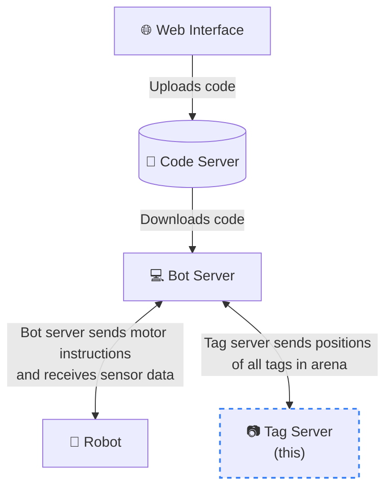

# AutoSumo Tag Server

Recognizes arena boundaries and robot locations using [apriltags](https://april.eecs.umich.edu/software/apriltag) and publishes them on a websocket.

```mermaid
flowchart TD
    web["🌐 Web Interface"] -->|Uploads code| code-server[("💾 Code Server")]
    code-server -->|Downloads code| bot-server["💻 Bot Server"]
    bot-server <-->|Bot server sends motor instructions\nand receives sensor data| robot["🤖 Robot"]
    bot-server <-->|Tag server sends positions of all tags in arena| tag-server["📷 Tag Server\n(this)"]
    
    style tag-server stroke-width:2px,stroke-dasharray: 5 5,stroke:#3b82f6
    
    click web "https://github.com/AutoSumo/web"
    click code-server "https://github.com/AutoSumo/code-server"
    click bot-server "https://github.com/AutoSumo/server"
    click robot "https://github.com/AutoSumo/robot"
```